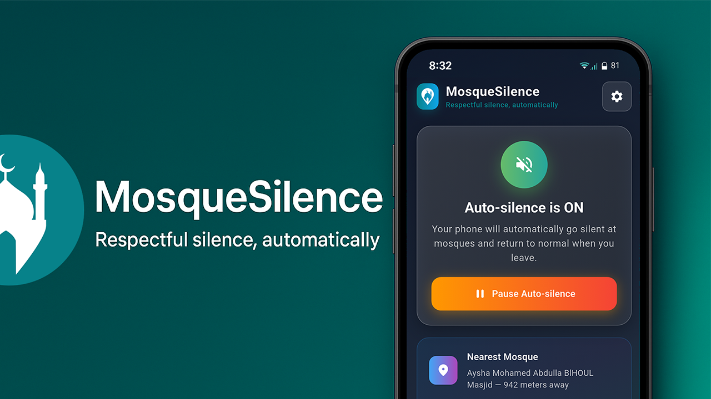
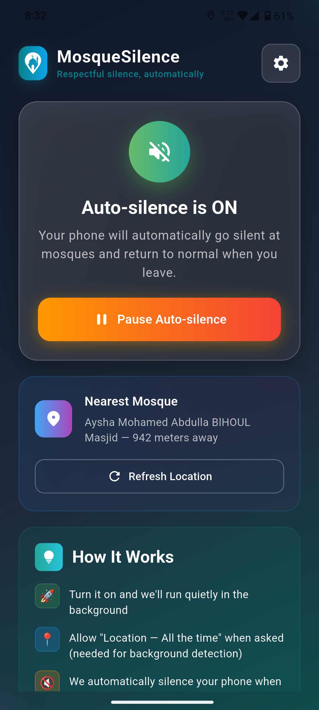
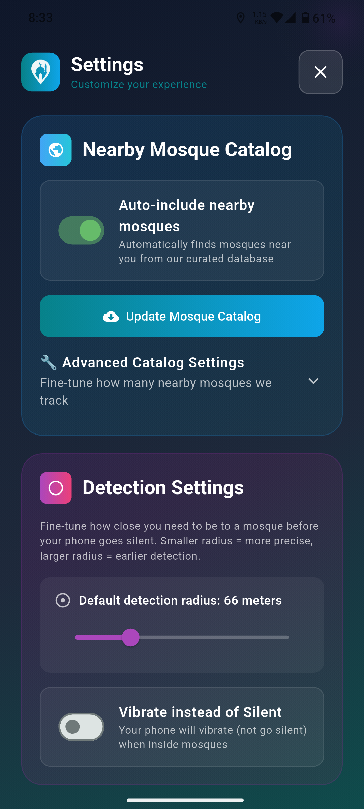

  


### MosqueSilence auto‑silences your phone when you’re inside a mosque and restores normal sound when you leave. It runs quietly in the background using a curated mosque catalog plus your own saved locations.


 
---

## Screenshots

| Main screen | Side screen |
|---|---|
|  |  |
---

## Features

- Background auto‑silence using Android geofences
- Nearby mosque catalog + custom locations you add
- Optional low‑priority, persistent status notification
- Movement‑aware: keeps only the nearest *N* zones active
- No DND toggling; we warn if Android blocks ringer changes while DND is on

## How It Works

1. Turn on **Enable background auto‑silence** in the app.
2. Grant **Location – Allow all the time** and **Notifications** (Android 13+).
3. The app starts a foreground geofence service with nearby mosques (and your custom ones).
4. On **enter** → ringer set to *Silent* (or *Vibrate* if you chose). On **exit** → back to *Normal*.

## Permissions

- **Location (Always)** — required for background geofencing.
- **Notifications** — to show the status entry.
- **Do Not Disturb** — *not modified*. If DND is ON, Android may block ringer changes; the app warns but never toggles DND.

## Build

```bash
flutter pub get
flutter run
# Android only for now; minSdk 29; Material 3
```

## Roadmap

- Expand CSV catalog beyond UAE
- Background catalog refresh
- Optional haptic/toast on state change (respect DND & notif prefs)

## Contributing

Issues and PRs are welcome. Please describe the change and test on at least one Android 12+ device.

## License

MIT


